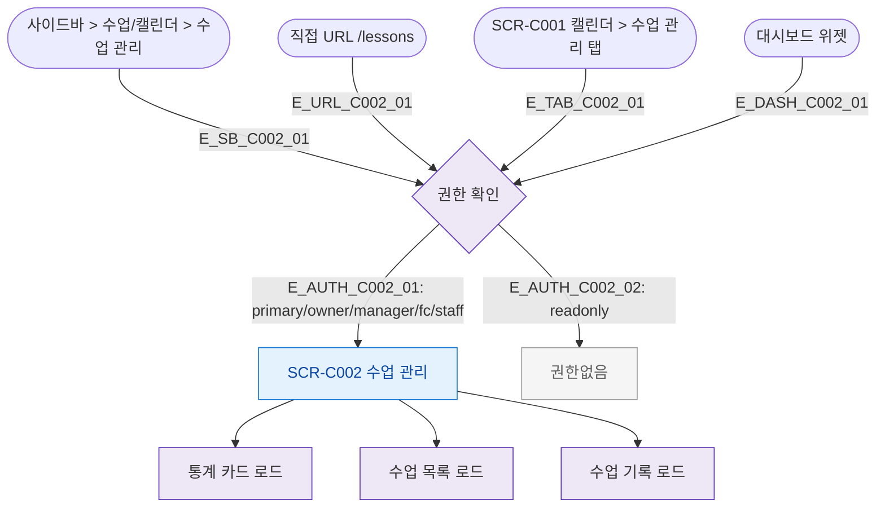

## 1. 목적
SCR-C002 수업 관리 화면으로 진입할 수 있는 모든 경로를 정의한다.

## 2. 전제조건
- 로그인 완료

## 3. 다이어그램

## 4. 엣지 설명

| 엣지 ID | 출발 | 도착 | 조건 |
|---------|------|------|------|
| E_SB_C002_01 | 사이드바 | Auth | 메뉴 클릭 |
| E_TAB_C002_01 | SCR-C001 탭 | Auth | 탭 클릭 |
| E_AUTH_C002_01 | Auth | SCR_C002 | 권한 있음 |
| E_AUTH_C002_02 | Auth | Blocked | readonly |

## 5. TC 후보

| TC ID | 타입 | Given | When | Then |
|-------|------|-------|------|------|
| TC-C002-F1-01 | positive | 매니저 | 사이드바 수업관리 클릭 | SCR-C002 진입, 통계카드+테이블 표시 |
| TC-C002-F1-02 | positive | 트레이너 | 캘린더 수업관리 탭 클릭 | SCR-C002 진입, 본인수업 필터 적용 |
| TC-C002-F1-03 | negative | readonly | URL 직접 접근 | 권한없음 |
