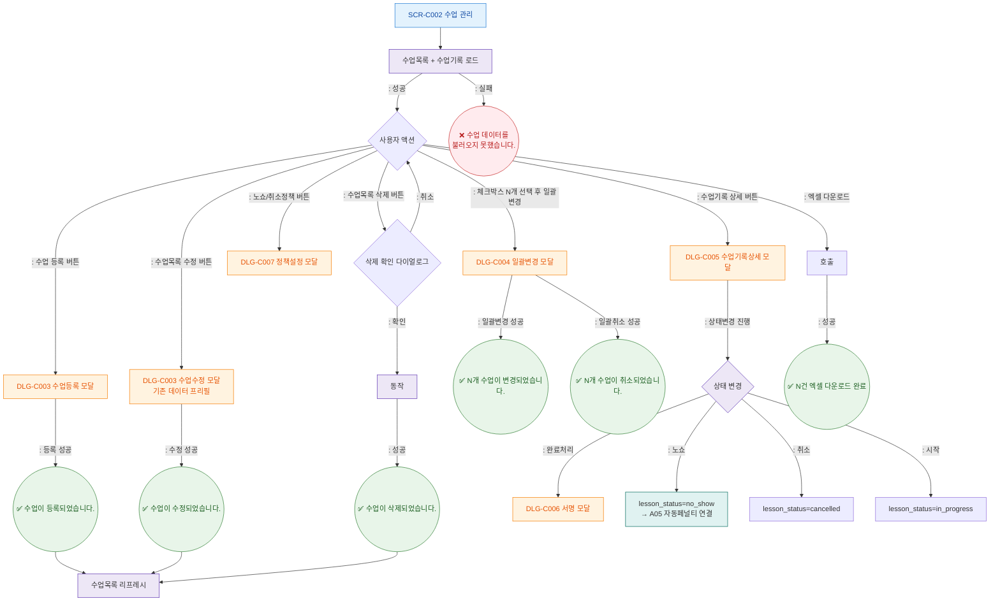

## 1. 목적
SCR-C002의 Happy Path — 수업 등록/수정/삭제, 기록 상세, 일괄변경, 노쇼정책 설정의 정상 흐름.

## 2. 전제조건
- SCR-C002 진입 완료

## 3. 다이어그램

## 4. 엣지 설명

| 출발 | 도착 | 조건 | |---------|------|------|------| | | Ready | DLG_C003_New | 수업 등록 버튼 | | | Ready | DLG_C003_Edit | 수정 버튼 | | | Ready | DelConfirm | 삭제 버튼 | | | Ready | DLG_C004 | N개 선택 후 일괄변경 | | | Ready | DLG_C007 | 노쇼/취소정책 버튼 | | | Ready | DLG_C005 | 상세 버튼 | | | StatusChange | DLG_C006 | 완료처리 → 서명 | | | StatusChange | LessonNoShow | 노쇼 → A05 크론 연결 |
