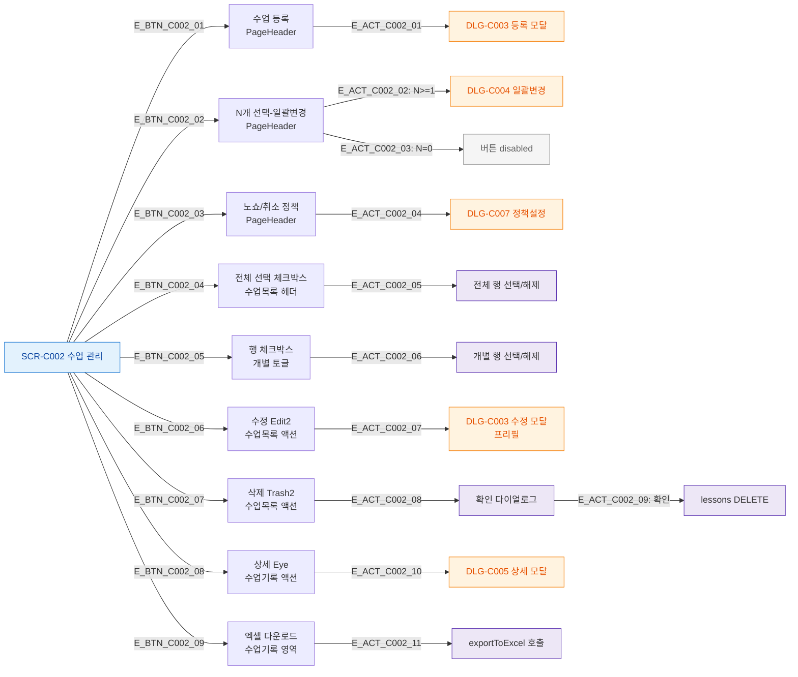

## 1. 목적
SCR-C002의 모든 버튼과 동작을 열거한다.

## 2. 전제조건
- SCR-C002 진입 완료

## 3. 다이어그램

## 4. 엣지 설명

| 버튼 | 위치 | 동작 | 비활성 조건 |
|------|------|------|-----------|
| 수업 등록 | PageHeader | DLG-C003 | 프론트/readonly |
| N개 선택-일괄변경 | PageHeader | DLG-C004 | 선택 0개 |
| 노쇼/취소 정책 | PageHeader | DLG-C007 | - |
| 수정 Edit2 | 수업목록 | DLG-C003 프리필 | fc 타강사 수업 |
| 삭제 Trash2 | 수업목록 | 확인→DELETE | fc 타강사 수업 |
| 상세 Eye | 수업기록 | DLG-C005 | - |
| 엑셀 다운로드 | 수업기록 | exportToExcel | - |

## 5. TC 후보

| TC ID | 타입 | Given | When | Then |
|-------|------|-------|------|------|
| TC-C002-F3-01 | positive | 매니저 | 수업 등록 버튼 | DLG-C003 열림 |
| TC-C002-F3-02 | negative | 매니저, 0개 선택 | 일괄변경 버튼 | disabled |
| TC-C002-F3-03 | positive | 매니저, 1개 선택 | 일괄변경 버튼 | DLG-C004 열림 |
| TC-C002-F3-04 | positive | 매니저 | 엑셀 다운로드 | 파일 다운로드 토스트 |
