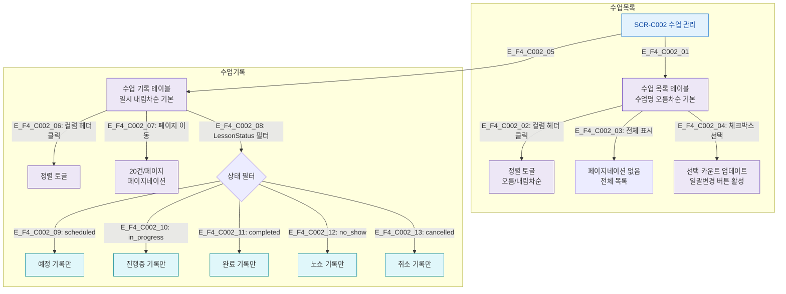

## 1. 목적
SCR-C002의 수업 목록/수업 기록 테이블의 정렬, 페이지네이션 플로우를 정의한다.

## 2. 전제조건
- SCR-C002 진입, 데이터 로드 완료

## 3. 다이어그램

## 4. 엣지 설명

| 구분 | 기본 정렬 | 페이지네이션 |
|------|----------|------------|
| 수업 목록 | 수업명 오름차순 | 전체 표시 |
| 수업 기록 | 일시 내림차순 | 20건/페이지 |

## 5. TC 후보

| TC ID | 타입 | Given | When | Then |
|-------|------|-------|------|------|
| TC-C002-F4-01 | positive | 매니저 | 수업명 헤더 클릭 | 정렬 방향 토글 |
| TC-C002-F4-02 | positive | 매니저, 21개 기록 | 2페이지 클릭 | 21번째 기록부터 표시 |
| TC-C002-F4-03 | positive | 매니저 | 체크박스 전체 선택 | 모든 행 선택 |
