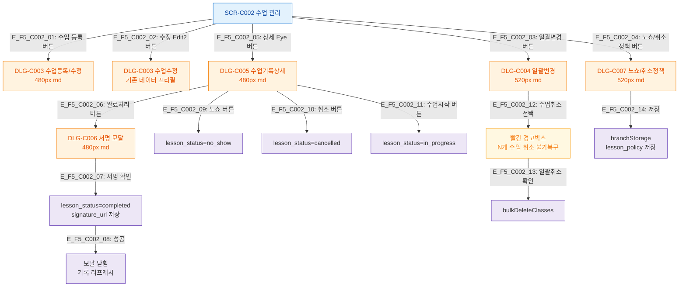

## 1. 목적
SCR-C002에서 트리거 가능한 모든 모달과 하위 모달 연결 트리를 정의한다.

## 2. 전제조건
- SCR-C002 진입 완료

## 3. 다이어그램

## 4. 엣지 설명

| 엣지 ID | 출발 | 도착 | 조건 |
|---------|------|------|------|
| E_F5_C002_01~02 | SCR_C002 | DLG_C003 | 등록/수정 버튼 |
| E_F5_C002_05 | SCR_C002 | DLG_C005 | 상세 버튼 |
| E_F5_C002_06 | DLG_C005 | DLG_C006 | 완료처리 버튼 (서명 모달 체인) |
| E_F5_C002_09~11 | DLG_C005 | 상태변경 | 노쇼/취소/시작 버튼 |
| E_F5_C002_12~13 | DLG_C004 | 일괄취소 경고 | 취소 선택 시 경고 → 확인 |

## 5. TC 후보

| TC ID | 타입 | Given | When | Then |
|-------|------|-------|------|------|
| TC-C002-F5-01 | positive | 매니저, scheduled 기록 | 상세→완료처리 | DLG-C006 서명 모달 열림 |
| TC-C002-F5-02 | positive | 매니저, DLG-C006 | 서명 후 확인 | completed 처리, 서명URL 저장 |
| TC-C002-F5-03 | positive | 매니저, N개 선택 | 일괄변경→취소 선택 | 빨간 경고박스 표시 |
| TC-C002-F5-04 | positive | 매니저 | 노쇼/취소정책 버튼 | DLG-C007 열림, 필드 표시 |
