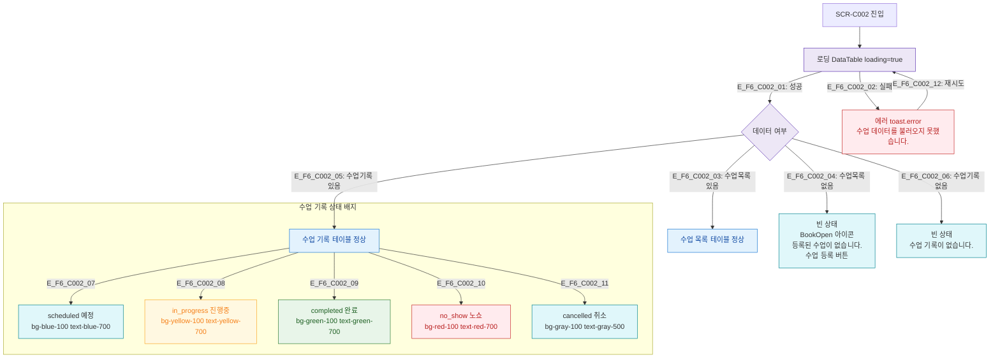

## 1. 목적
SCR-C002의 로딩/정상/빈/에러 상태를 정의한다.

## 2. 전제조건
- SCR-C002 진입 시도

## 3. 다이어그램

## 4. 엣지 설명

| 상태 | 화면 표현 |
|------|----------|
| 로딩 | DataTable loading=true 스켈레톤 |
| 수업목록 빈 | BookOpen 아이콘 + "등록된 수업이 없습니다." + 등록 버튼 |
| 수업기록 빈 | "수업 기록이 없습니다." |
| 에러 | toast.error + 재시도 |

## 5. TC 후보

| TC ID | 타입 | Given | When | Then |
|-------|------|-------|------|------|
| TC-C002-F6-01 | positive | 매니저, 수업 없음 | SCR-C002 진입 | 빈 상태 + 수업 등록 버튼 |
| TC-C002-F6-02 | negative | API 500 | SCR-C002 진입 | 에러 토스트 |
| TC-C002-F6-03 | positive | 노쇼 처리된 기록 | 테이블 조회 | 빨간 배지 노쇼 표시 |
