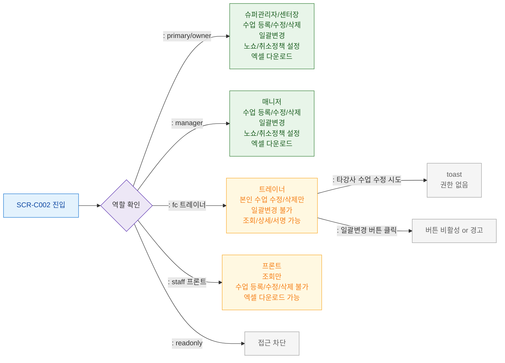

## 1. 목적
SCR-C002에서 6개 역할별 기능 접근 범위를 정의한다.

## 2. 전제조건
- 로그인 완료

## 3. 다이어그램

## 4. 엣지 설명

| 역할 | 등록 | 수정 | 삭제 | 일괄변경 | 정책설정 | |------|------|------|------|---------|---------| | primary/owner | O | O(전체) | O | O | O | | manager | O | O(전체) | O | O | O | | fc(트레이너) | X | O(본인) | O(본인) | X | X | | staff(프론트) | X | X | X | X | X | | readonly | 접근차단 | - | - | - | - |
