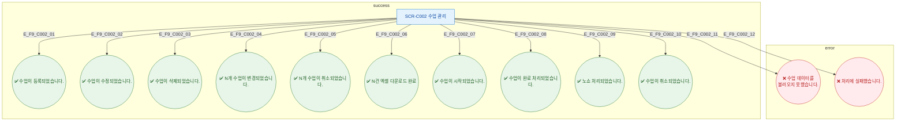

## 1. 목적
SCR-C002에서 발생 가능한 모든 토스트 메시지 조건을 정의한다.

## 2. 전제조건
- SCR-C002 진입 완료

## 3. 다이어그램

## 4. 엣지 설명

| 엣지 ID | 토스트 | 타입 | 트리거 |
|---------|--------|------|--------|
| E_F9_C002_01 | 수업이 등록되었습니다. | success | 등록 API 200 |
| E_F9_C002_04 | N개 수업이 변경되었습니다. | success | 일괄변경 200 |
| E_F9_C002_08 | 수업이 완료 처리되었습니다. | success | 서명 완료 |
| E_F9_C002_09 | 노쇼 처리되었습니다. | success | no_show UPDATE |
| E_F9_C002_11 | 데이터 로드 실패 | error | API 500 |

## 5. TC 후보

| TC ID | 타입 | Given | When | Then |
|-------|------|-------|------|------|
| TC-C002-F9-01 | positive | 매니저 | 수업 등록 성공 | success 토스트 |
| TC-C002-F9-02 | positive | 매니저 | 노쇼 처리 | "노쇼 처리되었습니다." success |
| TC-C002-F9-03 | positive | 매니저 | 서명 완료 | "수업이 완료 처리되었습니다." success |
| TC-C002-F9-04 | negative | API 500 | 처리 시도 | "처리에 실패했습니다." error |
