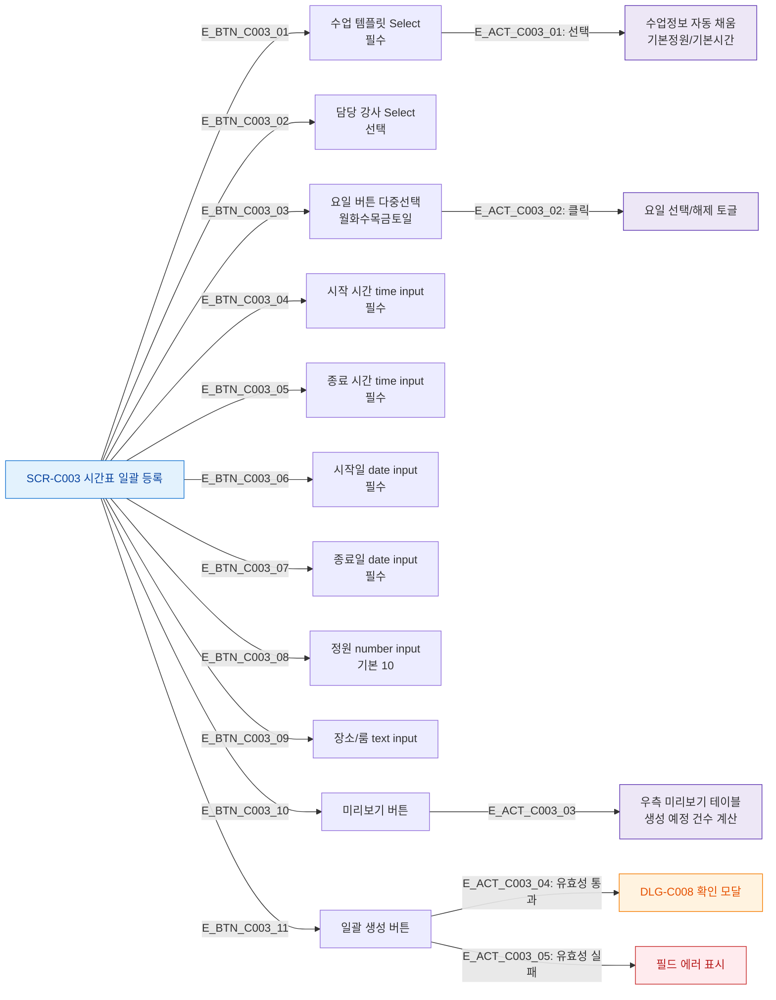

## 1. 목적
SCR-C003의 모든 버튼과 동작을 열거한다.

## 2. 전제조건
- SCR-C003 진입 완료

## 3. 다이어그램

## 4. 엣지 설명

| 버튼 | 동작 | 비고 |
|------|------|------|
| 수업 템플릿 Select | 기본정원/시간 자동 채움 | 필수 |
| 요일 버튼 | 다중 토글 | 1개 이상 필수 |
| 미리보기 | 우측 테이블 표시/숨기기 | - |
| 일괄 생성 | 유효성 → DLG-C008 | 필수 필드 모두 입력 시 |

## 5. TC 후보

| TC ID | 타입 | Given | When | Then |
|-------|------|-------|------|------|
| TC-C003-F3-01 | positive | 매니저 | 템플릿 선택 | 기본정원/시간 자동 입력 |
| TC-C003-F3-02 | positive | 매니저 | 요일 버튼 클릭 | 선택/해제 토글 |
| TC-C003-F3-03 | positive | 매니저, 폼 입력 | 미리보기 버튼 | 우측 테이블 표시 |
