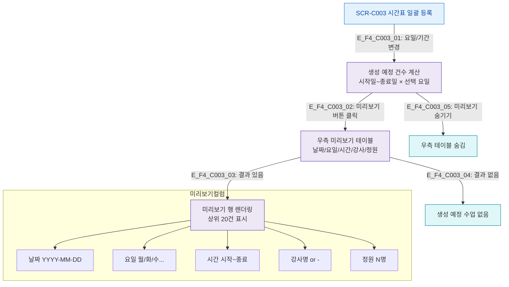

## 1. 목적
SCR-C003 미리보기 테이블 필터링 및 생성 예정 건수 계산 플로우를 정의한다.

## 2. 전제조건
- SCR-C003 진입, 폼 입력 중

## 3. 다이어그램

## 4. 엣지 설명

| 엣지 ID | 출발 | 도착 | 조건 |
|---------|------|------|------|
| E_F4_C003_01 | SCR_C003 | CalcPreview | 요일/기간 변경 시 자동 계산 |
| E_F4_C003_02 | CalcPreview | ShowTable | 미리보기 버튼 클릭 |
| E_F4_C003_03~04 | ShowTable | 결과/빈 | 데이터 유무 |

## 5. TC 후보

| TC ID | 타입 | Given | When | Then |
|-------|------|-------|------|------|
| TC-C003-F4-01 | positive | 매니저, 월~금 선택, 2주 기간 | 미리보기 버튼 | 10건 미리보기 표시 |
| TC-C003-F4-02 | positive | 매니저 | 미리보기 재클릭 | 테이블 숨김 |
| TC-C003-F4-03 | negative | 요일 미선택 | 미리보기 버튼 | 빈 결과 |
