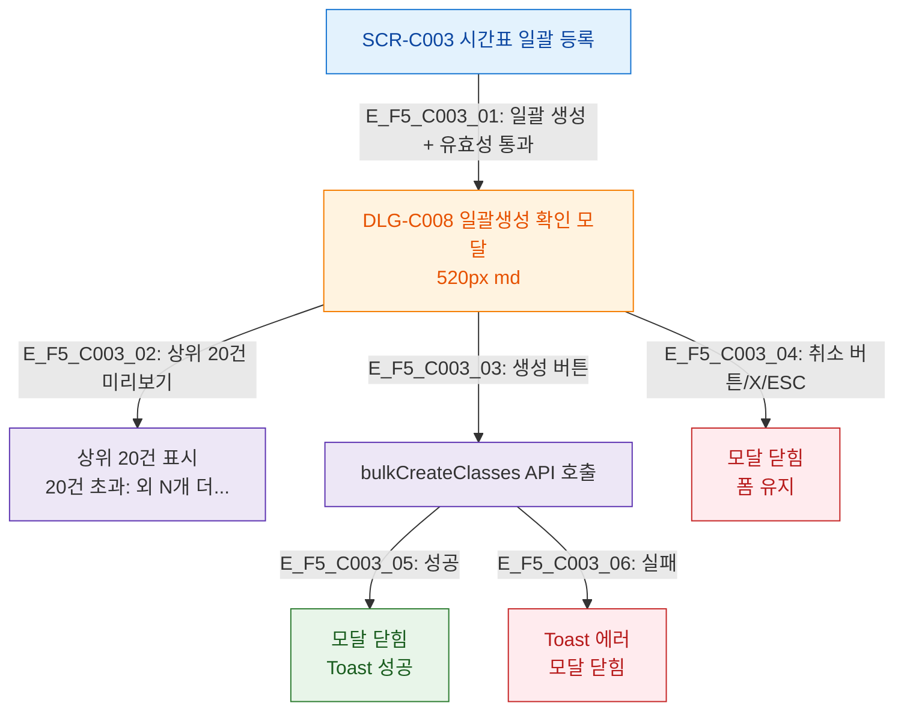

## 1. 목적
SCR-C003에서 트리거되는 모달(DLG-C008)의 연결 트리를 정의한다.

## 2. 전제조건
- SCR-C003 진입, 유효성 검증 통과

## 3. 다이어그램

## 4. 엣지 설명

| 엣지 ID | 출발 | 도착 | 조건 |
|---------|------|------|------|
| E_F5_C003_01 | SCR_C003 | DLG_C008 | 유효성 통과 |
| E_F5_C003_03 | DLG_C008 | BulkAPI | 생성 버튼 |
| E_F5_C003_04 | DLG_C008 | CloseModal | 취소/X/ESC |

## 5. TC 후보

| TC ID | 타입 | Given | When | Then |
|-------|------|-------|------|------|
| TC-C003-F5-01 | positive | 매니저, 유효성 통과 | 일괄 생성 | DLG-C008 열림, 미리보기 표시 |
| TC-C003-F5-02 | positive | DLG-C008 | 생성 버튼 | API 호출, 토스트 |
| TC-C003-F5-03 | positive | DLG-C008 | 취소 버튼 | 모달 닫힘, 폼 유지 |
