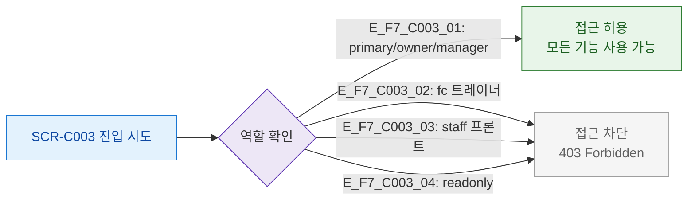

## 1. 목적
SCR-C003의 역할별 접근 범위를 정의한다.

## 2. 전제조건
- 로그인 완료

## 3. 다이어그램

## 4. 엣지 설명

| 역할 | 접근 |
|------|------|
| primary/owner/manager | O |
| fc/staff/readonly | X (접근 차단) |

## 5. TC 후보

| TC ID | 타입 | Given | When | Then |
|-------|------|-------|------|------|
| TC-C003-F7-01 | positive | manager | SCR-C003 접근 | 정상 진입 |
| TC-C003-F7-02 | negative | fc 트레이너 | SCR-C003 접근 | 접근 차단 |
| TC-C003-F7-03 | negative | staff 프론트 | SCR-C003 접근 | 접근 차단 |
