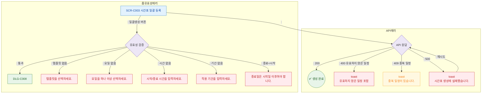

## 1. 목적
SCR-C003에서 발생 가능한 에러코드별 분기와 복구 경로를 정의한다.

## 2. 전제조건
- SCR-C003 진입 또는 생성 중

## 3. 다이어그램

## 4. 엣지 설명

| 에러 유형 | 코드 | 동작 | |-----------|-----|------| | 폼 유효성 | - | 필드별 에러 메시지 | | 유효하지 않은 일정 | 400 | 에러 토스트 | | 중복 일정 | 409 | 경고 토스트 | | 서버 에러 | 500 | 에러 토스트 + 재시도 |
