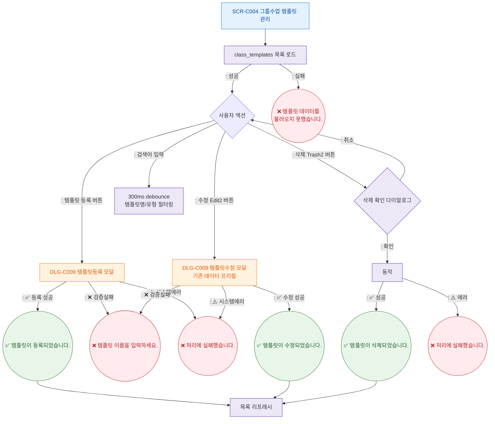

## 1. 목적
SCR-C004의 Happy Path — 템플릿 등록/수정/삭제의 정상 흐름. 3갈래 분기(성공/검증실패/시스템에러) 강제.

## 2. 전제조건
- SCR-C004 진입, 데이터 로드 완료

## 3. 다이어그램

## 4. 엣지 설명

| 출발 | 도착 | 조건 | |---------|------|------|------| | | Ready | DLG_C009_New | 등록 버튼 | | | DLG_C009_New | Toast_Reg | 성공 분기 | | | DLG_C009_New | Toast_VErr | 검증 실패 분기 | | | DLG_C009_New | Toast_SErr | 시스템 에러 분기 |
