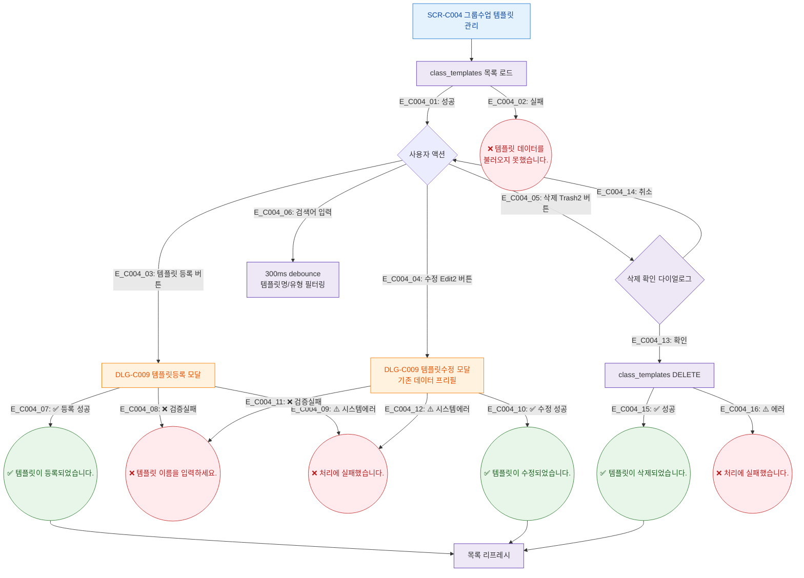

## 1. 목적
SCR-C004의 Happy Path — 템플릿 등록/수정/삭제의 정상 흐름. 3갈래 분기(성공/검증실패/시스템에러) 강제.

## 2. 전제조건
- SCR-C004 진입, 데이터 로드 완료

## 3. 다이어그램

## 4. 엣지 설명

| 엣지 ID | 출발 | 도착 | 조건 |
|---------|------|------|------|
| E_C004_03 | Ready | DLG_C009_New | 등록 버튼 |
| E_C004_07 | DLG_C009_New | Toast_Reg | 성공 분기 |
| E_C004_08 | DLG_C009_New | Toast_VErr | 검증 실패 분기 |
| E_C004_09 | DLG_C009_New | Toast_SErr | 시스템 에러 분기 |

## 5. TC 후보

| TC ID | 타입 | Given | When | Then |
|-------|------|-------|------|------|
| TC-C004-F2-01 | positive | 매니저 | 템플릿 등록 성공 | "템플릿이 등록되었습니다." |
| TC-C004-F2-02 | negative | 매니저, 이름 빈값 | 등록 시도 | "템플릿 이름을 입력하세요." |
| TC-C004-F2-03 | positive | 매니저 | 템플릿 삭제 확인 | "템플릿이 삭제되었습니다." |
| TC-C004-F2-04 | positive | 매니저 | 검색어 입력 | 300ms 후 필터 적용 |
| TC-C004-F2-05 | exception | API 500 | 등록 시도 | "처리에 실패했습니다." |
