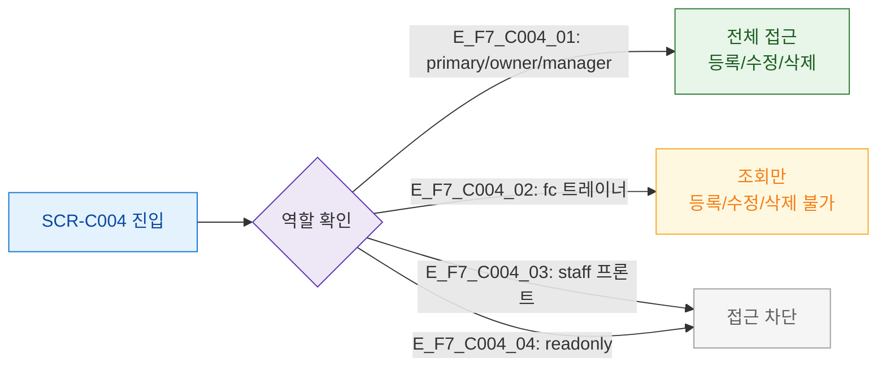

## 1. 목적
SCR-C004의 역할별 접근 범위를 정의한다.

## 2. 전제조건
- 로그인 완료

## 3. 다이어그램

## 4. 엣지 설명

| 역할 | 접근 | 등록/수정/삭제 |
|------|------|--------------|
| primary/owner/manager | O | O |
| fc(트레이너) | O | X(조회만) |
| staff/readonly | X | X |

## 5. TC 후보

| TC ID | 타입 | Given | When | Then |
|-------|------|-------|------|------|
| TC-C004-F7-01 | positive | manager | 템플릿 등록 버튼 | 활성, DLG-C009 열림 |
| TC-C004-F7-02 | negative | fc | 등록 버튼 | 비활성 or 숨김 |
| TC-C004-F7-03 | negative | staff | URL 직접 접근 | 접근 차단 |
