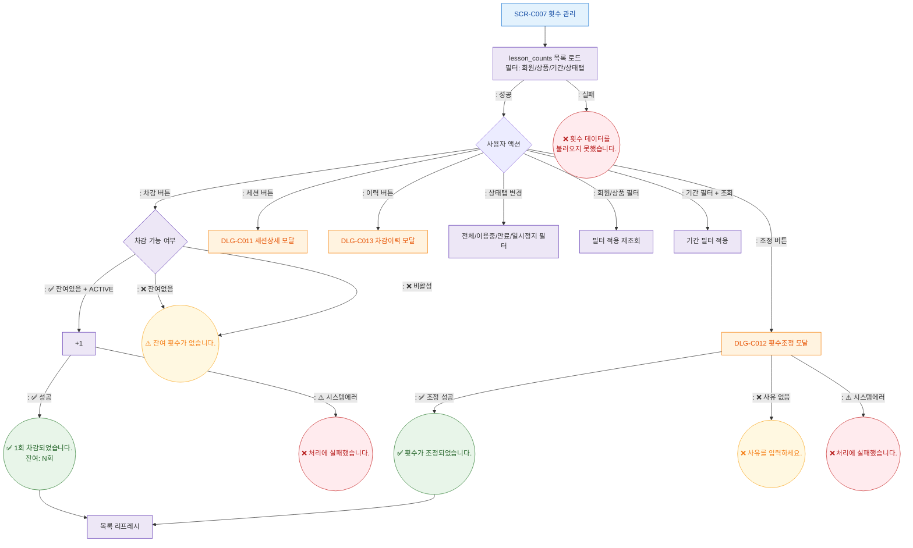

## 1. 목적
SCR-C007의 Happy Path — 수강권 횟수 차감/조정/세션상세/이력 조회의 정상 흐름. 3갈래 분기 강제.

## 2. 전제조건
- SCR-C007 진입, 데이터 로드 완료

## 3. 다이어그램

## 4. 엣지 설명

| 출발 | 도착 | 조건 | |---------|------|------|------| | | DeductCheck | Deduct | 잔여있음 + ACTIVE (성공 분기) | | ~06 | DeductCheck | Toast_NoDed | 잔여없음/비활성 (검증실패 분기) | | | Deduct | Toast_DedErr | 시스템에러 분기 | | | Ready | DLG_C012 | 조정 버튼 | | | Ready | DLG_C011 | 세션 버튼 | | | Ready | DLG_C013 | 이력 버튼 |
