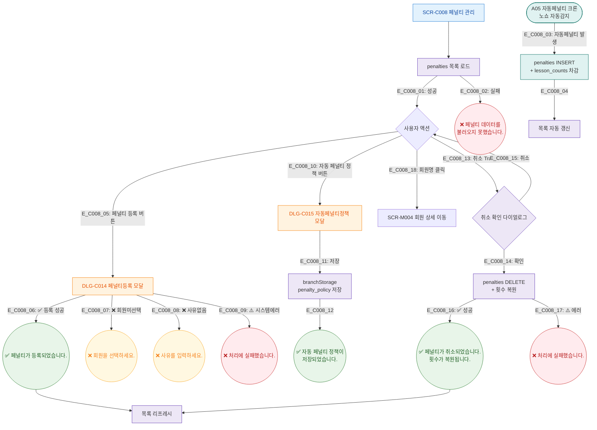

## 1. 목적
SCR-C008의 Happy Path — 페널티 등록/취소, 자동정책 설정의 정상 흐름. A05 자동페널티 크론 연결 포함. 3갈래 분기 강제.

## 2. 전제조건
- SCR-C008 진입, 데이터 로드 완료

## 3. 다이어그램

## 4. 엣지 설명

| 엣지 ID | 출발 | 도착 | 조건 |
|---------|------|------|------|
| E_C008_03 | A05 크론 | AutoPenalty | 노쇼 자동감지 이벤트 |
| E_C008_06 | DLG_C014 | Toast_Reg | 성공 분기 |
| E_C008_07~08 | DLG_C014 | Toast_VErr | 검증 실패 분기 |
| E_C008_09 | DLG_C014 | Toast_SErr | 시스템 에러 분기 |
| E_C008_14 | CancelConfirm | CancelAPI | 횟수 복원 포함 |

## 5. TC 후보

| TC ID | 타입 | Given | When | Then |
|-------|------|-------|------|------|
| TC-C008-F2-01 | positive | 매니저 | 페널티 등록 성공 | "페널티가 등록되었습니다." |
| TC-C008-F2-02 | negative | 회원 미선택 | 등록 시도 | "회원을 선택하세요." |
| TC-C008-F2-03 | positive | 매니저 | 페널티 취소 확인 | "취소, 횟수 복원" 토스트 |
| TC-C008-F2-04 | positive | 자동페널티 정책 저장 | DLG-C015 저장 | 정책 저장 토스트 |
| TC-C008-F2-05 | system | A05 크론 실행 | 노쇼 발생 | 자동 페널티 등록, 횟수 차감 |
