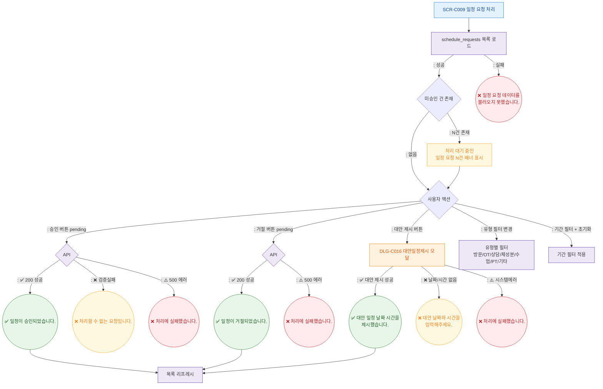

## 1. 목적
SCR-C009의 Happy Path — 일정 요청 승인/거절/대안제시의 정상 흐름. 3갈래 분기 강제.

## 2. 전제조건
- SCR-C009 진입, 데이터 로드 완료

## 3. 다이어그램

## 4. 엣지 설명

| 출발 | 도착 | 조건 | |---------|------|------|------| | | ApproveAPI | Toast_Approve | 성공 분기 | | | ApproveAPI | Toast_VErr | 검증 실패 분기 | | | ApproveAPI | Toast_AErr | 시스템 에러 분기 | | | Ready | DLG_C016 | 대안 제시 → 대안일정제시 모달 |
