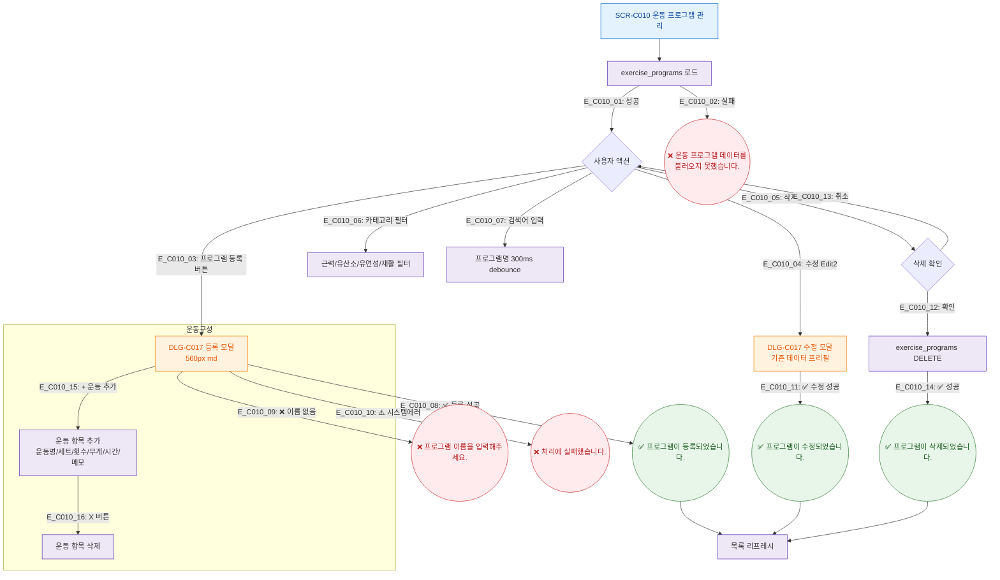

## 1. 목적
SCR-C010의 Happy Path — 운동 프로그램 등록/수정/삭제의 정상 흐름. 3갈래 분기 강제.

## 2. 전제조건
- SCR-C010 진입 완료

## 3. 다이어그램

## 4. 엣지 설명

| 엣지 ID | 출발 | 도착 | 조건 |
|---------|------|------|------|
| E_C010_08 | DLG_New | Toast_Reg | 성공 분기 |
| E_C010_09 | DLG_New | Toast_VErr | 검증 실패 분기 |
| E_C010_10 | DLG_New | Toast_SErr | 시스템 에러 분기 |
| E_C010_15~16 | DLG_New | 운동구성 | 동적 리스트 추가/삭제 |

## 5. TC 후보

| TC ID | 타입 | Given | When | Then |
|-------|------|-------|------|------|
| TC-C010-F2-01 | positive | 매니저 | 프로그램 등록 성공 | 토스트, 목록 갱신 |
| TC-C010-F2-02 | negative | 이름 없음 | 등록 시도 | 에러 메시지 |
| TC-C010-F2-03 | positive | 매니저 | + 운동 추가 클릭 | 운동 항목 행 추가 |
| TC-C010-F2-04 | positive | 매니저 | 카테고리 필터 근력 | 근력 프로그램만 표시 |
