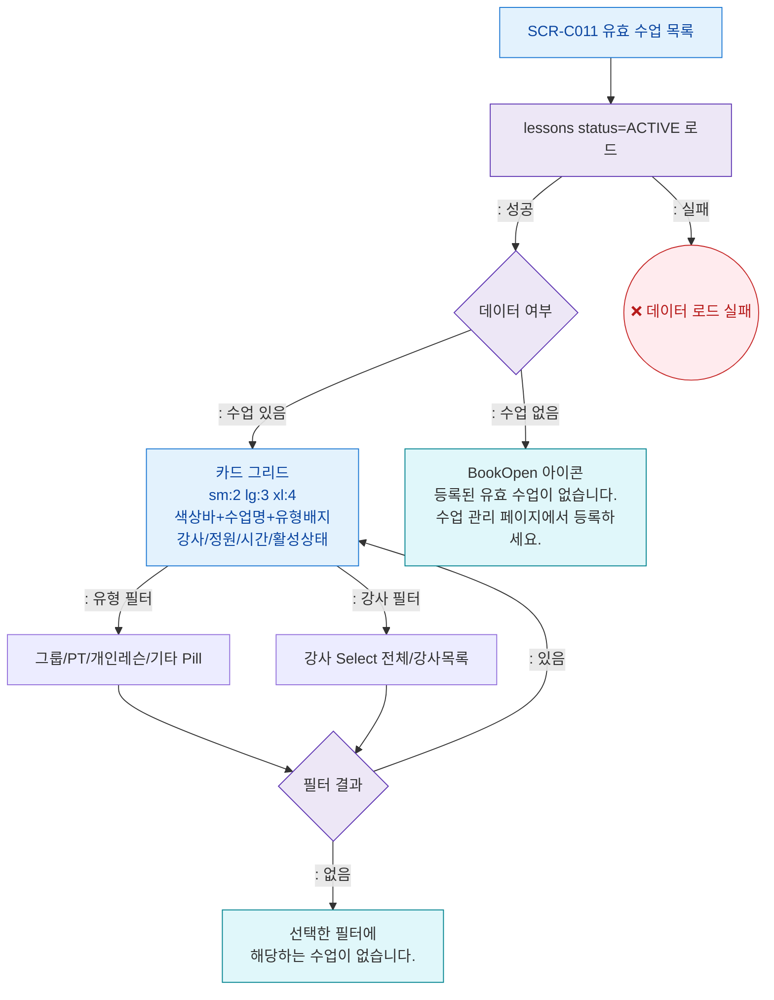

## 1. 목적
SCR-C011의 Happy Path — 유효 수업 카드 그리드 조회, 필터링의 정상 흐름.

## 2. 전제조건
- SCR-C011 진입 완료 (캘린더 유효수업 탭)

## 3. 다이어그램

## 4. 엣지 설명

| 출발 | 도착 | 조건 | |---------|------|------|------| | | DataCheck | CardGrid | ACTIVE 수업 있음 | | | DataCheck | EmptyState | 수업 없음 | | ~06 | CardGrid | 각 필터 | 필터 조작 | | | FilterResult | FilterEmpty | 필터 결과 없음 |
