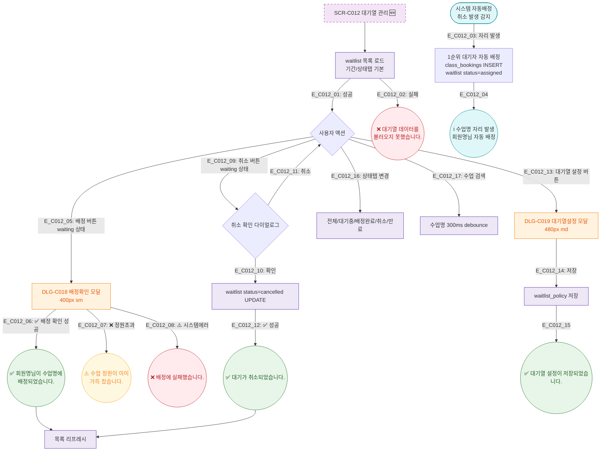

## 1. 목적
SCR-C012의 Happy Path — 대기열 조회, 수동 배정, 대기 취소, 자동 배정 연동의 정상 흐름. 3갈래 분기 강제.

## 2. 전제조건
- SCR-C012 진입 완료

## 3. 다이어그램

## 4. 엣지 설명

| 엣지 ID | 출발 | 도착 | 조건 |
|---------|------|------|------|
| E_C012_03 | 시스템 | AutoAssign | 취소 발생 → 자동배정 |
| E_C012_06 | AssignConfirm | Toast_Assign | 성공 분기 |
| E_C012_07 | AssignConfirm | Toast_Full | 정원초과 검증 실패 분기 |
| E_C012_08 | AssignConfirm | Toast_AErr | 시스템 에러 분기 |
| E_C012_09~12 | Ready/CancelConfirm | 취소 | 대기 취소 흐름 |

## 5. TC 후보

| TC ID | 타입 | Given | When | Then |
|-------|------|-------|------|------|
| TC-C012-F2-01 | positive | 매니저, waiting 대기자 | 배정 버튼 | DLG-C018 열림, 배정 완료 |
| TC-C012-F2-02 | negative | 정원 가득 찬 수업 | 배정 시도 | "정원이 가득 찼습니다." |
| TC-C012-F2-03 | positive | 매니저, waiting 대기자 | 취소 버튼 | "대기가 취소되었습니다." |
| TC-C012-F2-04 | system | 취소 발생 | 자동 배정 트리거 | 1순위 대기자 자동 배정 알림 |
| TC-C012-F2-05 | positive | 매니저 | 대기열 설정 저장 | 설정 저장 토스트 |
