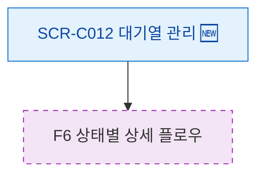

## 1. 목적
SCR-C012 대기열 관리 — F6 상태별 플로우 (🆕 신규기능)

## 2. 전제조건
- SCR-C012 진입 완료

## 3. 다이어그램

```mermaid
flowchart TD
  SCR_C012[SCR-C012 대기열 관리 🆕]
  SCR_C012 --> Placeholder[F6 상태별 상세 플로우]

  classDef screen fill:#E3F2FD,stroke:#1976D2,color:#0D47A1
  classDef newFeature fill:#F3E5F5,stroke:#9C27B0,stroke-dasharray:5 5
  class SCR_C012 screen
  class Placeholder newFeature
```

## 4. 엣지 설명
- 화면설계서 SCR-C012 기반

## 5. TC 후보
- TC 도출 예정
