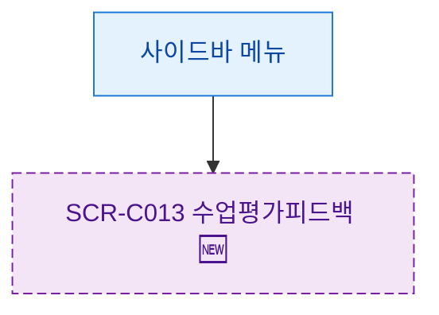

## 1. 목적
SCR-C013 진입 경로를 정의한다.

## 2. 전제조건
- 로그인 완료

## 3. 다이어그램

```mermaid
flowchart TD
  SCR_NODE[SCR-C013 수업평가피드백 🆕]
  Sidebar[사이드바 메뉴] --> SCR_NODE
  classDef screen fill:#E3F2FD,stroke:#1976D2,color:#0D47A1
  classDef newFeature fill:#F3E5F5,stroke:#7B1FA2,color:#4A148C,stroke-dasharray:6 3
  class SCR_NODE newFeature
  class Sidebar screen
```

## 4. 엣지 설명

| 경로 | 조건 | |---------|------|------| | | 사이드바 | 메뉴 클릭 |
