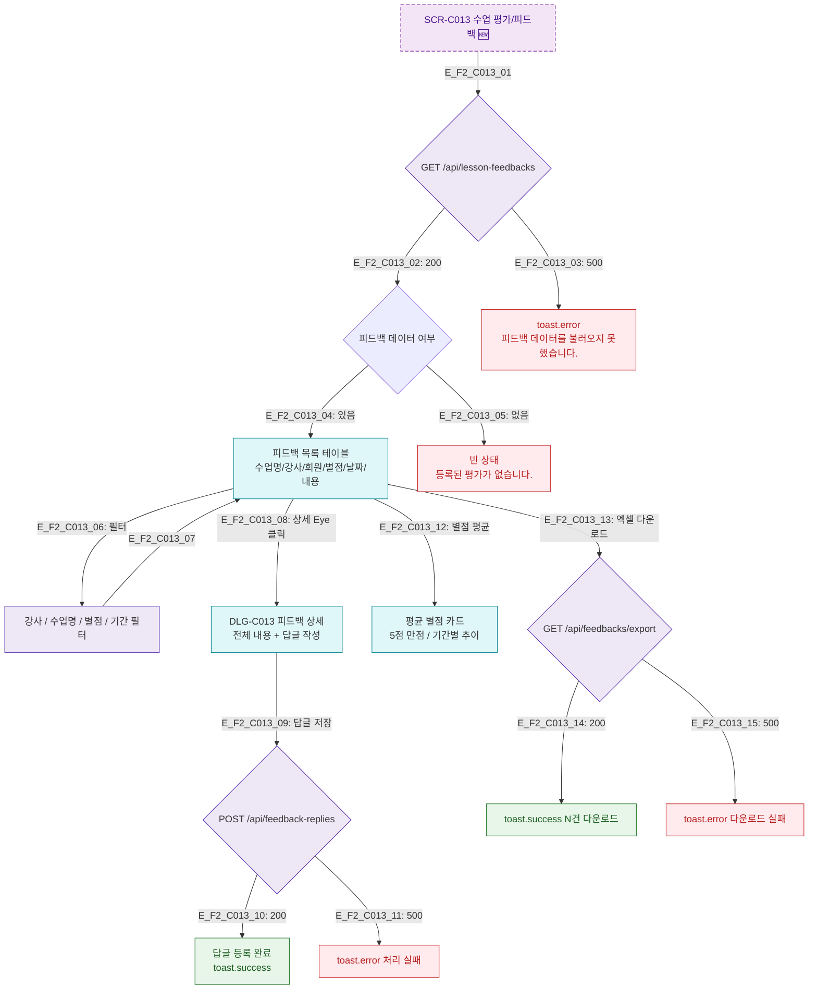

## 1. 목적
SCR-C013에서 수업 완료 후 평가 및 피드백 등록/조회/관리 메인 플로우를 정의한다.

## 2. 전제조건
- 로그인 완료
- lesson_status = completed 수업 존재

## 3. 다이어그램

## 4. 엣지 설명

| 엣지 ID | 출발 | 도착 | 조건 |
|---------|------|------|------|
| E_F2_C013_01 | SCR_C013 | LoadAPI | 화면 진입 시 자동 로드 |
| E_F2_C013_06~07 | FeedbackTable | FilterBar | 강사/수업명/별점/기간 필터 적용 |
| E_F2_C013_08 | FeedbackTable | DetailModal | 상세 버튼 클릭 |
| E_F2_C013_09~10 | DetailModal | ReplyAPI | 답글 저장 |
| E_F2_C013_12 | FeedbackTable | RatingSummary | 별점 평균 카드 렌더링 |
| E_F2_C013_13~14 | FeedbackTable | ExcelAPI | 엑셀 다운로드 |

## 5. TC 후보

| TC ID | 타입 | Given | When | Then |
|-------|------|-------|------|------|
| TC-C013-F2-01 | positive | 매니저, 완료 수업 있음 | SCR-C013 진입 | 피드백 목록 테이블 렌더링 |
| TC-C013-F2-02 | positive | 매니저 | 상세 클릭 후 답글 저장 | 답글 등록 success 토스트 |
| TC-C013-F2-03 | positive | 매니저 | 별점 필터 3점 이상 | 해당 피드백만 표시 |
| TC-C013-F2-04 | negative | API 500 | 진입 시 | 에러 토스트 |
