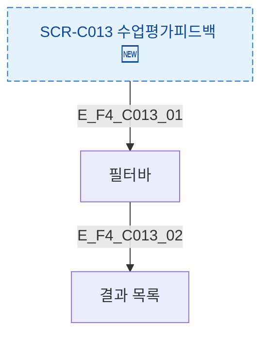

## 1. 목적
SCR-C013 필터 및 검색 플로우를 정의한다.

## 2. 전제조건
- SCR-C013 진입 완료

## 3. 다이어그램

## 4. 엣지 설명

| 엣지 ID | 필터 | 동작 |
|---------|------|------|
| E_F4_C013_01 | 필터바 | 조건 입력 |

## 5. TC 후보

| TC ID | 타입 | Given | When | Then |
|-------|------|-------|------|------|
| TC-C013-F4-01 | positive | 매니저 | 필터 적용 | 결과 필터링 |
