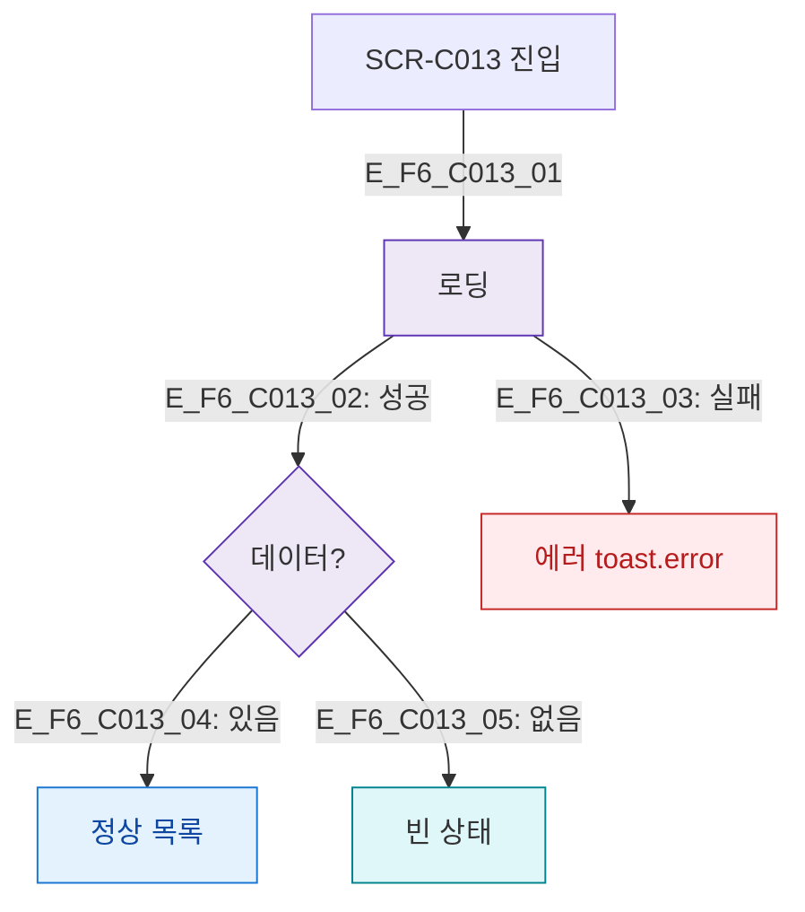

## 1. 목적
SCR-C013 로딩/정상/빈/에러 상태를 정의한다.

## 2. 전제조건
- SCR-C013 진입

## 3. 다이어그램

## 4. 엣지 설명

| 상태 | 화면 |
|------|------|
| 로딩 | 스켈레톤 |
| 빈 | 빈 상태 메시지 |
| 에러 | toast.error |

## 5. TC 후보

| TC ID | 타입 | Given | When | Then |
|-------|------|-------|------|------|
| TC-C013-F6-01 | positive | 데이터 있음 | 진입 | 목록 렌더링 |
| TC-C013-F6-02 | negative | API 500 | 진입 | 에러 토스트 |
