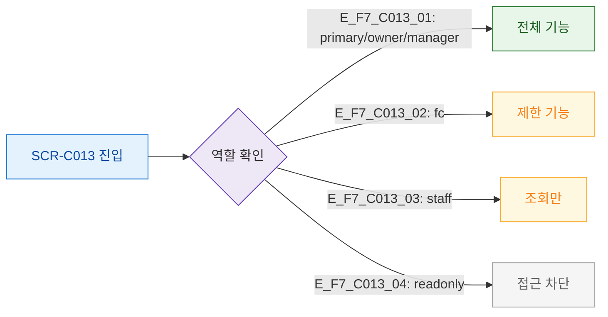

## 1. 목적
SCR-C013 역할별 접근 범위를 정의한다.

## 2. 전제조건
- 로그인 완료

## 3. 다이어그램

## 4. 엣지 설명

| 역할 | 접근 범위 |
|------|----------|
| primary/owner/manager | 전체 |
| fc | 제한 |
| staff | 조회만 |
| readonly | 차단 |

## 5. TC 후보

| TC ID | 타입 | Given | When | Then |
|-------|------|-------|------|------|
| TC-C013-F7-01 | positive | manager | 진입 | 전체 기능 |
| TC-C013-F7-02 | negative | readonly | 진입 | 접근 차단 |
