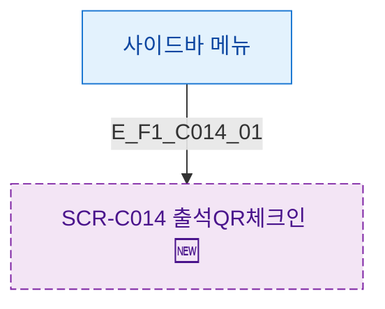

## 1. 목적
SCR-C014 진입 경로를 정의한다.

## 2. 전제조건
- 로그인 완료

## 3. 다이어그램

## 4. 엣지 설명

| 엣지 ID | 경로 | 조건 |
|---------|------|------|
| E_F1_C014_01 | 사이드바 | 메뉴 클릭 |

## 5. TC 후보

| TC ID | 타입 | Given | When | Then |
|-------|------|-------|------|------|
| TC-C014-F1-01 | positive | 로그인 | 사이드바 클릭 | 화면 진입 |
