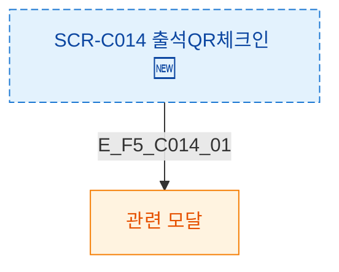

## 1. 목적
SCR-C014 모달 트리거를 정의한다.

## 2. 전제조건
- SCR-C014 진입 완료

## 3. 다이어그램

## 4. 엣지 설명

| 엣지 ID | 트리거 | 모달 |
|---------|--------|------|
| E_F5_C014_01 | 버튼 클릭 | 관련 모달 |

## 5. TC 후보

| TC ID | 타입 | Given | When | Then |
|-------|------|-------|------|------|
| TC-C014-F5-01 | positive | 매니저 | 버튼 클릭 | 모달 열림 |
