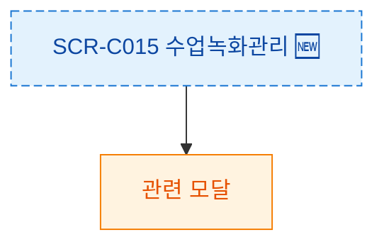

## 1. 목적
SCR-C015 모달 트리거를 정의한다.

## 2. 전제조건
- SCR-C015 진입 완료

## 3. 다이어그램

```mermaid
flowchart TD
  SCR_NODE[SCR-C015 수업녹화관리 🆕]
  SCR_NODE --> DLG[관련 모달]
  classDef screen fill:#E3F2FD,stroke:#1976D2,color:#0D47A1
  classDef modal fill:#FFF3E0,stroke:#F57C00,color:#E65100
  classDef newFeature fill:#F3E5F5,stroke:#7B1FA2,color:#4A148C,stroke-dasharray:6 3
  class SCR_NODE newFeature
  class SCR_NODE screen
  class DLG modal
```

## 4. 엣지 설명

| 트리거 | 모달 | |---------|--------|------| | | 버튼 클릭 | 관련 모달 |
