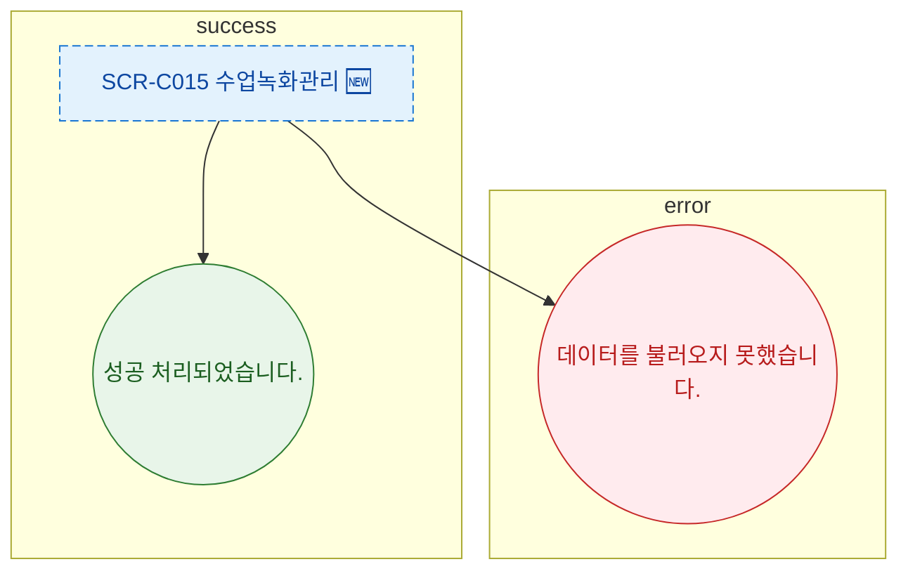

## 1. 목적
SCR-C015 토스트 메시지 조건을 정의한다.

## 2. 전제조건
- SCR-C015 진입 완료

## 3. 다이어그램

## 4. 엣지 설명

| 토스트 | 타입 | 트리거 | |---------|--------|------|--------| | | 성공 처리 | success | API 200 | | | 로드 실패 | error | API 500 |
