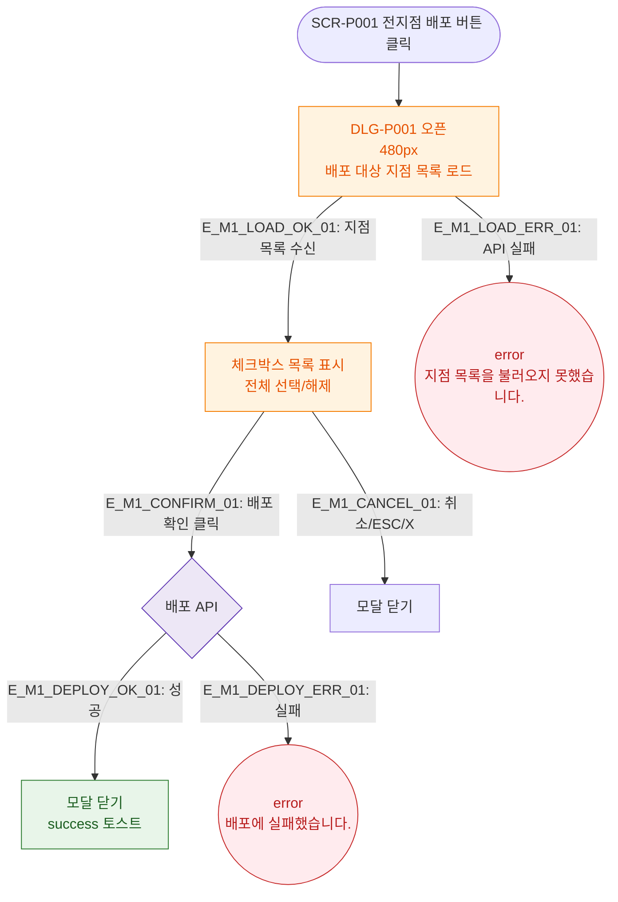

# M1 모달 생명주기 — DLG-P001 전지점 배포

## 다이어그램

## TC 후보

| TC ID | 타입 | Given | When | Then |
|-------|------|-------|------|------|
| TC-DLG-P001-M1-01 | positive | 지점 선택 후 배포 확인 | 확인 클릭 | 모달 닫힘, success 토스트 |
| TC-DLG-P001-M1-02 | negative | API 실패 | 배포 확인 클릭 | error 토스트, 모달 유지 |
