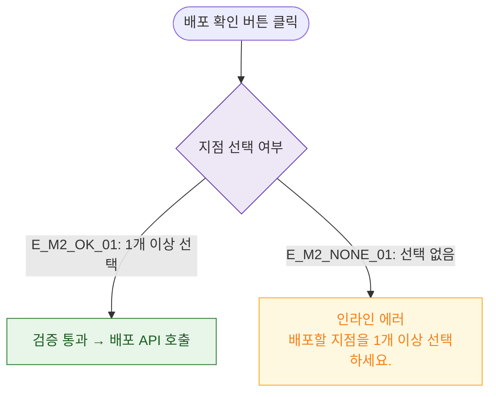

# M2 필드 검증 — DLG-P001 전지점 배포

## 다이어그램

## TC 후보

| TC ID | 타입 | Given | When | Then |
|-------|------|-------|------|------|
| TC-DLG-P001-M2-01 | positive | 지점 1개 이상 선택 | 확인 클릭 | 검증 통과, 배포 진행 |
| TC-DLG-P001-M2-02 | negative | 지점 미선택 | 확인 클릭 | 인라인 에러 "1개 이상 선택하세요." |
