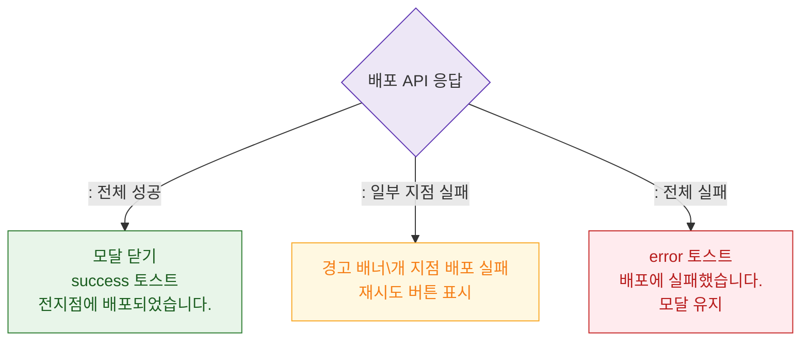

# M3 결과 분기 — DLG-P001 전지점 배포

## 다이어그램

## TC 후보

| TC ID | 타입 | Given | When | Then | |-------|------|-------|------|------| | TC-DLG-P001-M3-01 | positive | 전체 지점 배포 성공 | API 200 | 모달 닫힘, success 토스트 | | TC-DLG-P001-M3-02 | negative | 일부 지점 실패 | API 부분 오류 | 경고 배너 + 재시도 버튼 | | TC-DLG-P001-M3-03 | negative | 전체 실패 | API 500 | error 토스트, 모달 유지 |
