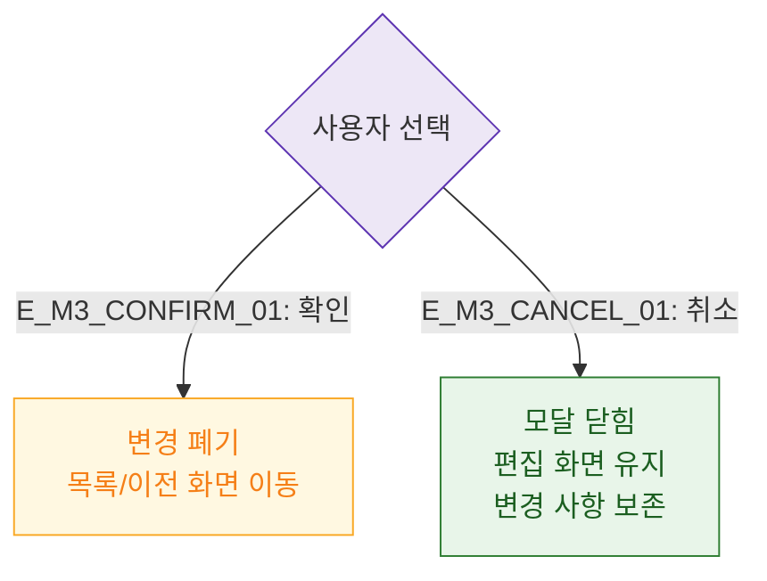

# M3 결과 분기 — DLG-P002 작업 취소 확인

## 다이어그램

## TC 후보

| TC ID | 타입 | Given | When | Then |
|-------|------|-------|------|------|
| TC-DLG-P002-M3-01 | positive | 확인 선택 | 확인 클릭 | 변경 폐기, 이전 화면 이동 |
| TC-DLG-P002-M3-02 | positive | 취소 선택 | 취소 클릭 | 모달 닫힘, 편집 화면 유지 |
