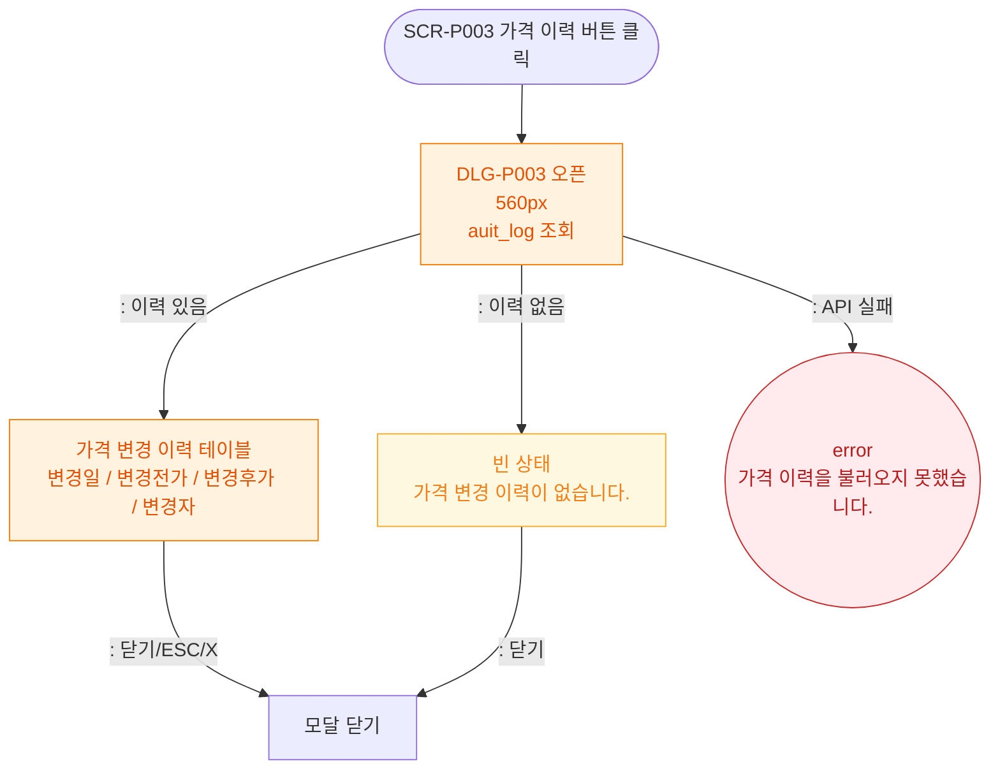

# M1 모달 생명주기 — DLG-P003 가격 이력

## 다이어그램

## TC 후보

| TC ID | 타입 | Given | When | Then | |-------|------|-------|------|------| | TC-DLG-P003-M1-01 | positive | 가격 이력 있음 | 이력 버튼 클릭 | 이력 테이블 표시 | | TC-DLG-P003-M1-02 | negative | API 실패 | 이력 버튼 클릭 | error 토스트 |
