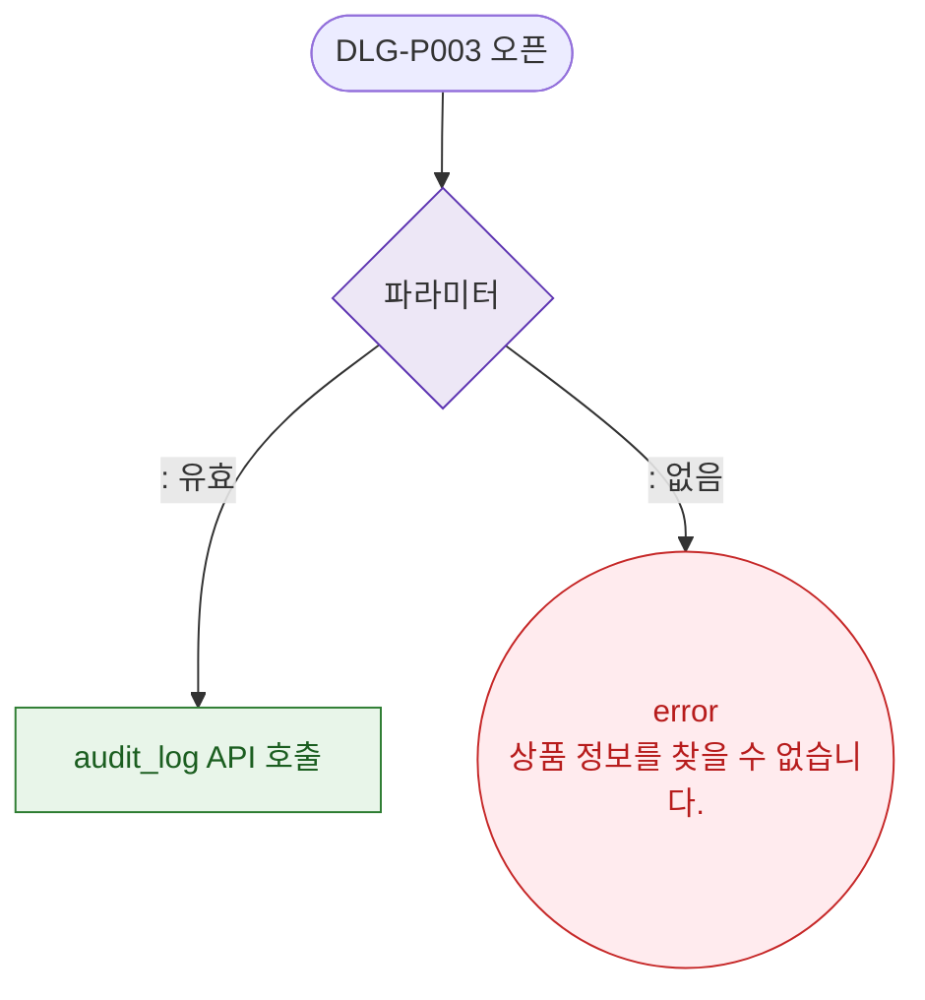

# M2 필드 검증 — DLG-P003 가격 이력

## 다이어그램

## TC 후보

| TC ID | 타입 | Given | When | Then | |-------|------|-------|------|------| | TC-DLG-P003-M2-01 | negative | 없이 모달 오픈 | 직접 접근 | error "상품 정보를 찾을 수 없습니다." |
