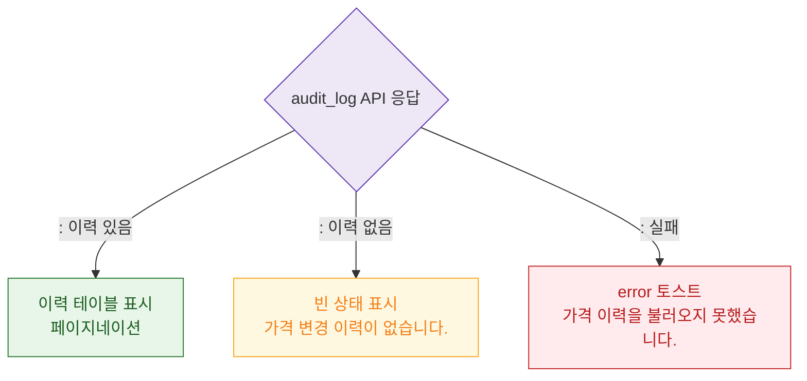

# M3 결과 분기 — DLG-P003 가격 이력

## 다이어그램

## TC 후보

| TC ID | 타입 | Given | When | Then | |-------|------|-------|------|------| | TC-DLG-P003-M3-01 | positive | 이력 있음 | 모달 오픈 | 이력 테이블 표시 | | TC-DLG-P003-M3-02 | positive | 이력 없음 | 모달 오픈 | 빈 상태 "이력 없음" 표시 | | TC-DLG-P003-M3-03 | negative | API 실패 | 모달 오픈 | error 토스트 |
