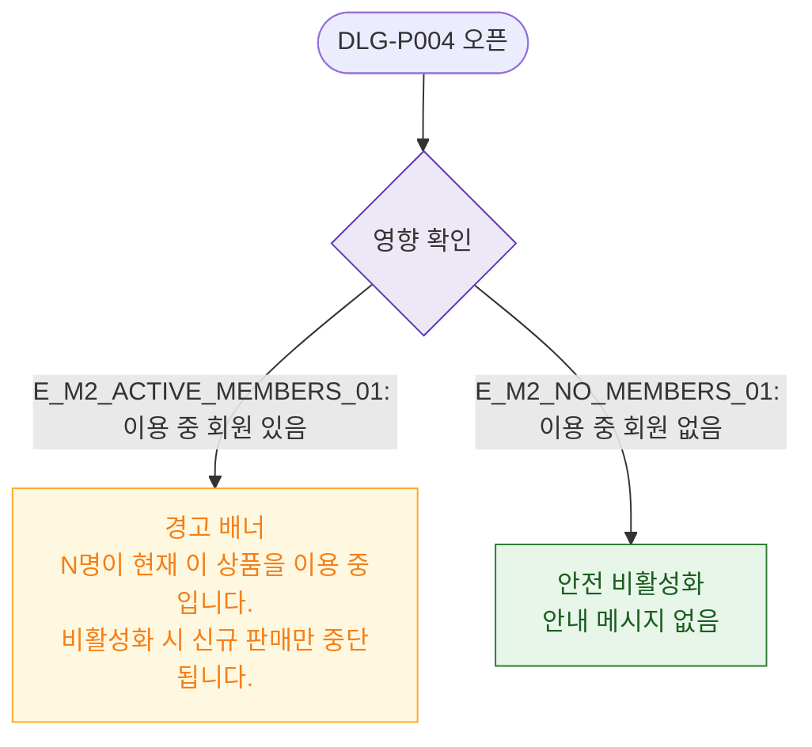

# M2 필드 검증 — DLG-P004 비활성화 안내

## 다이어그램

## TC 후보

| TC ID | 타입 | Given | When | Then |
|-------|------|-------|------|------|
| TC-DLG-P004-M2-01 | positive | 이용 중 회원 있음 | 모달 오픈 | 경고 배너 "N명 이용 중" 표시 |
| TC-DLG-P004-M2-02 | positive | 이용 중 회원 없음 | 모달 오픈 | 경고 배너 없음 |
