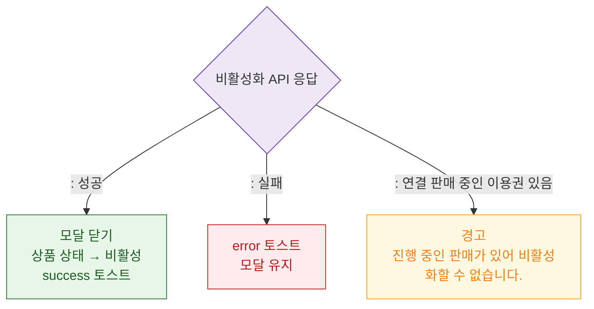

# M3 결과 분기 — DLG-P004 비활성화 안내

## 다이어그램

## TC 후보

| TC ID | 타입 | Given | When | Then | |-------|------|-------|------|------| | TC-DLG-P004-M3-01 | positive | 비활성화 성공 | 확인 클릭 | 모달 닫힘, success 토스트 | | TC-DLG-P004-M3-02 | negative | 진행 중 판매 있음 | 확인 클릭 | 경고 "비활성화할 수 없습니다." |
