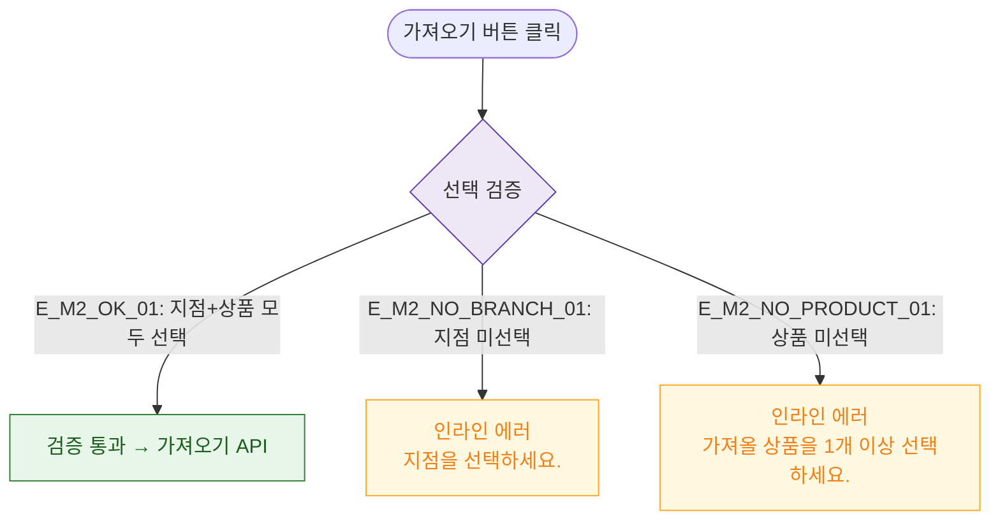

# M2 필드 검증 — DLG-P005 상품 가져오기

## 다이어그램

## TC 후보

| TC ID | 타입 | Given | When | Then |
|-------|------|-------|------|------|
| TC-DLG-P005-M2-01 | negative | 지점 미선택 | 가져오기 클릭 | 인라인 에러 "지점을 선택하세요." |
| TC-DLG-P005-M2-02 | negative | 상품 미선택 | 가져오기 클릭 | 인라인 에러 "1개 이상 선택하세요." |
