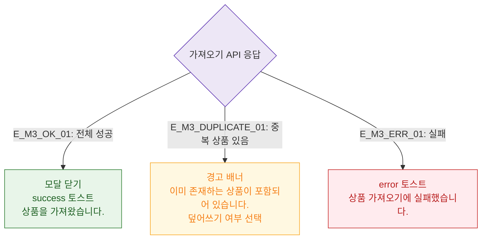

# M3 결과 분기 — DLG-P005 상품 가져오기

## 다이어그램

## TC 후보

| TC ID | 타입 | Given | When | Then |
|-------|------|-------|------|------|
| TC-DLG-P005-M3-01 | positive | 중복 없는 상품 가져오기 | API 성공 | 모달 닫힘, success 토스트 |
| TC-DLG-P005-M3-02 | negative | 중복 상품 포함 | API 응답 | 경고 배너 + 덮어쓰기 선택 |
| TC-DLG-P005-M3-03 | negative | API 실패 | 가져오기 | error 토스트 |
