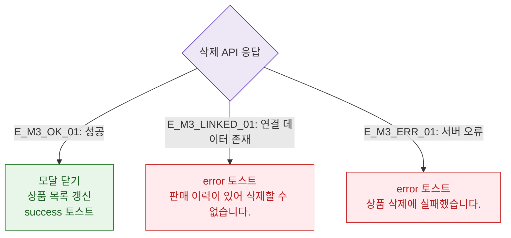

# M3 결과 분기 — DLG-P006 상품 삭제 확인

## 다이어그램

## TC 후보

| TC ID | 타입 | Given | When | Then |
|-------|------|-------|------|------|
| TC-DLG-P006-M3-01 | positive | 연결 없는 상품 삭제 | API 성공 | 모달 닫힘, 목록 갱신 |
| TC-DLG-P006-M3-02 | negative | 판매 이력 있는 상품 | API 거부 | error "판매 이력이 있어 삭제 불가" |
| TC-DLG-P006-M3-03 | negative | API 500 | 삭제 확인 | error 토스트 |
