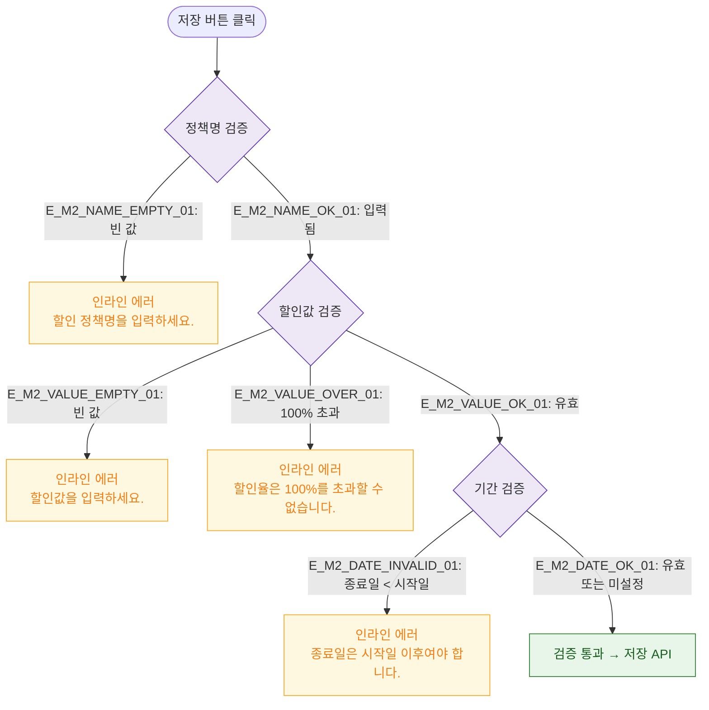

# M2 필드 검증 — DLG-P007 할인 정책 추가/수정

## 다이어그램

## TC 후보

| TC ID | 타입 | Given | When | Then |
|-------|------|-------|------|------|
| TC-DLG-P007-M2-01 | negative | 정책명 빈 값 | 저장 클릭 | 인라인 에러 "정책명을 입력하세요." |
| TC-DLG-P007-M2-02 | negative | 할인율 110% | 저장 클릭 | 인라인 에러 "100% 초과 불가" |
| TC-DLG-P007-M2-03 | negative | 종료일 < 시작일 | 저장 클릭 | 인라인 에러 "종료일은 시작일 이후" |
