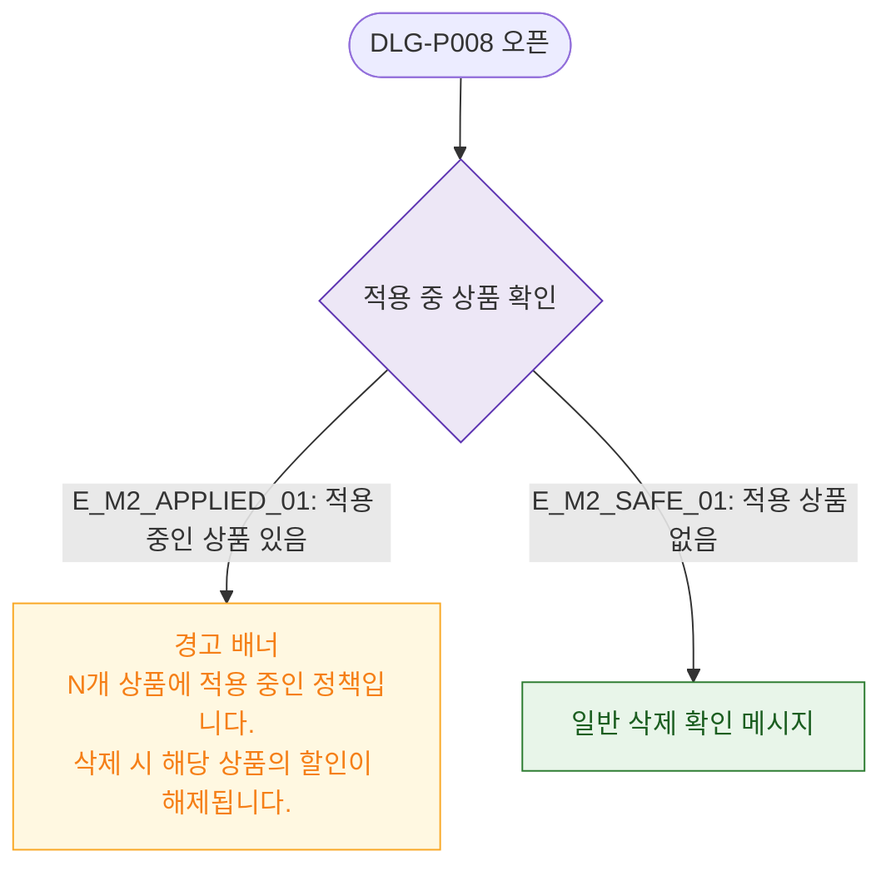

# M2 필드 검증 — DLG-P008 할인 정책 삭제 확인

## 다이어그램

## TC 후보

| TC ID | 타입 | Given | When | Then |
|-------|------|-------|------|------|
| TC-DLG-P008-M2-01 | negative | 적용 중 상품 있음 | 삭제 버튼 클릭 | 경고 배너 "N개 상품 할인 해제 안내" |
| TC-DLG-P008-M2-02 | positive | 적용 상품 없음 | 삭제 버튼 클릭 | 일반 삭제 확인 메시지 |
