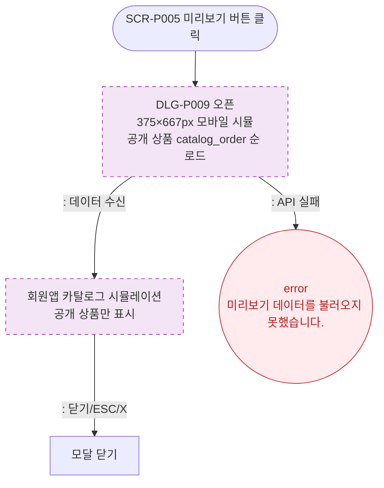

# M1 모달 생명주기 — DLG-P009 카탈로그 미리보기 🆕

## 다이어그램

## TC 후보

| TC ID | 타입 | Given | When | Then | |-------|------|-------|------|------| | TC-DLG-P009-M1-01 | positive | 미리보기 버튼 클릭 | 클릭 | 375px 모바일 시뮬 모달 오픈 | | TC-DLG-P009-M1-02 | negative | API 실패 | 모달 오픈 | error 토스트 |
