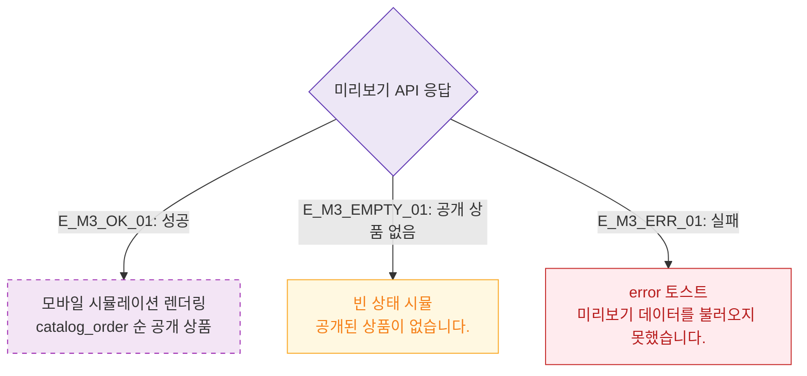

# M3 결과 분기 — DLG-P009 카탈로그 미리보기 🆕

## 다이어그램

## TC 후보

| TC ID | 타입 | Given | When | Then |
|-------|------|-------|------|------|
| TC-DLG-P009-M3-01 | positive | 공개 상품 있음 | 미리보기 오픈 | 모바일 시뮬 렌더링 |
| TC-DLG-P009-M3-02 | negative | API 실패 | 미리보기 오픈 | error 토스트 |
