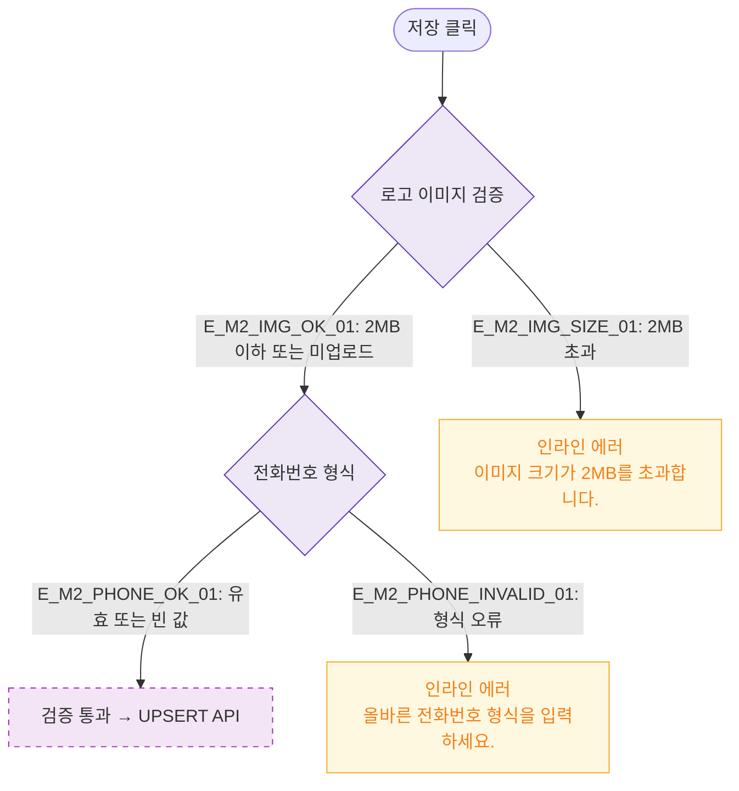

# M2 필드 검증 — DLG-P010 카탈로그 설정 🆕

## 다이어그램

## TC 후보

| TC ID | 타입 | Given | When | Then |
|-------|------|-------|------|------|
| TC-DLG-P010-M2-01 | negative | 로고 이미지 3MB | 저장 클릭 | 인라인 에러 "2MB 초과" |
| TC-DLG-P010-M2-02 | negative | 잘못된 전화번호 형식 | 저장 클릭 | 인라인 에러 "올바른 형식 입력" |
