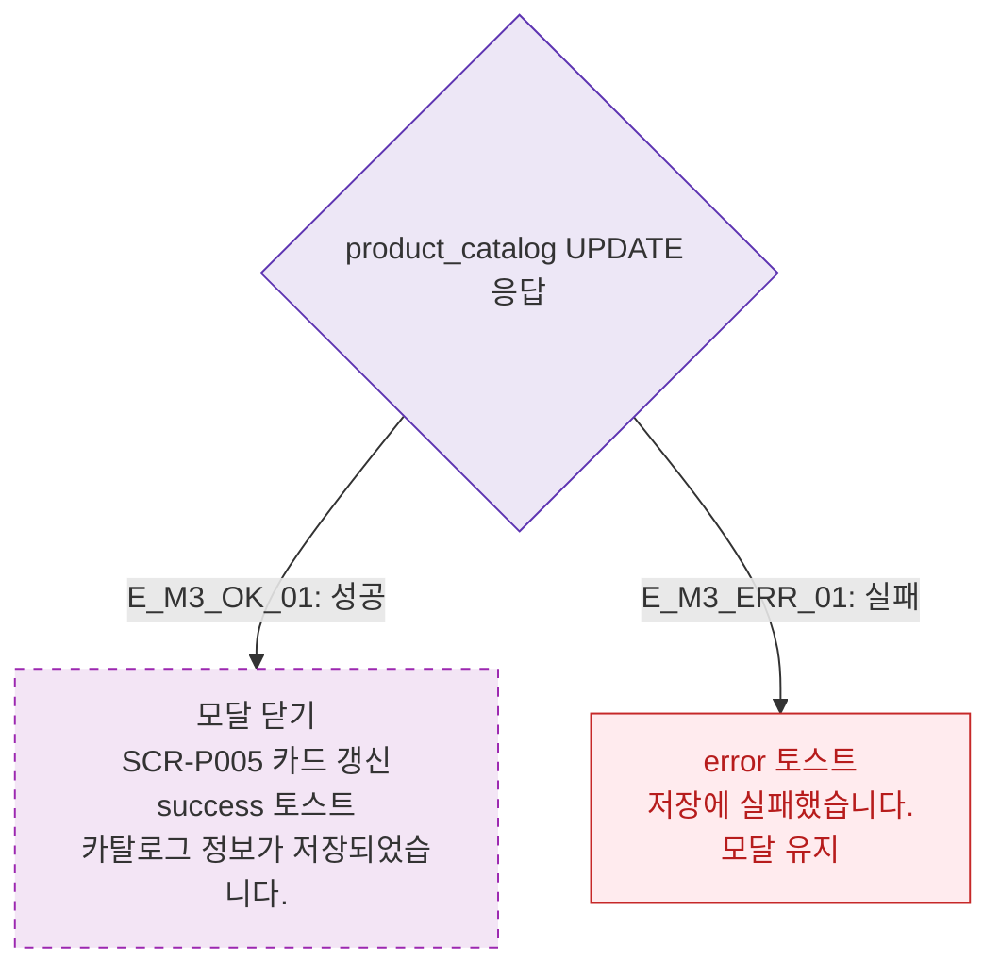

# M3 결과 분기 — DLG-P011 카탈로그 편집 🆕

## 다이어그램

## TC 후보

| TC ID | 타입 | Given | When | Then |
|-------|------|-------|------|------|
| TC-DLG-P011-M3-01 | positive | 편집 저장 성공 | API 200 | 모달 닫힘, 카드 갱신 |
| TC-DLG-P011-M3-02 | negative | API 실패 | 저장 클릭 | error 토스트, 모달 유지 |
